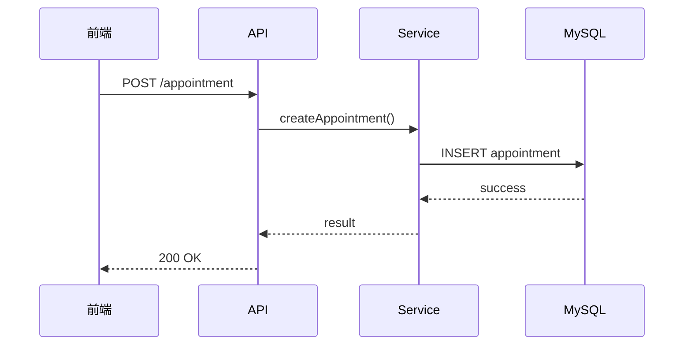

# 软件架构智能 Skill

## 核心目标

建立完整闭环：

需求 → 扫描 → 分析 → 设计图 → 实现 → 同步 → 审查

本 Skill 不只是 Mermaid 画图工具，而是项目级架构管理工作流。

## 支持的图

- 架构图：系统由什么组成、模块如何依赖
- 流程图：业务如何执行、条件如何分支
- 时序图：谁在什么时间调用谁
- 状态图：对象状态如何变化
- ER 图：数据实体如何关联
- 组件图：模块之间如何依赖

默认重点使用：架构图、流程图、时序图。

## 触发场景

适用于：

- 新增复杂功能、API、Service、模块
- 接入第三方服务
- 新增或修改 Redis、MQ、数据库
- 登录、支付、预约、订单等核心流程
- 异步任务
- 服务重构
- 模块依赖或系统架构变化

简单 CSS、文案、UI 调整和无架构影响的简单修复通常不触发。

# 工作模式

## Scan：扫描

1. 检查根目录和配置文件
2. 判断语言、框架、运行环境
3. 识别前端、后端、后台
4. 识别入口、路由、API
5. 识别 Controller、Service、Repository、Model
6. 识别 MySQL、Redis、MQ、OSS/CDN
7. 识别第三方 API
8. 分析重要调用链和依赖
9. 建立架构模型
10. 生成或更新 `docs/architecture/`

禁止凭空编造不存在的组件。

## Design：设计

复杂功能开发前：

1. 阅读当前架构
2. 找出受影响模块
3. 分析成功、失败和异常流程
4. 选择需要的图
5. 生成流程图和/或时序图
6. 必要时更新架构图
7. 分析 API、数据、依赖变化
8. 给出实现方案和风险

## Implement：实现

1. 阅读 `ARCHITECTURE.md`
2. 阅读相关图
3. 阅读现有代码
4. 按架构实现
5. 架构发生变化时同步更新图
6. 执行架构审查

## Sync：同步

1. 检查 `git diff`
2. 检查修改文件
3. 判断影响等级
4. 阅读受影响的图
5. 对比代码与图
6. 只更新受影响的图
7. 检查 Mermaid
8. 执行架构审查

# 图类型选择

- “业务怎么走” → 流程图
- “谁调用谁” → 时序图
- “系统由什么组成” → 架构图
- “状态怎么变化” → 状态图
- “数据怎么关联” → ER 图
- “模块怎么依赖” → 组件图

中等功能通常使用：流程图 + 时序图。
系统级变化使用：架构图 + 受影响的流程图/时序图。

# 项目扫描

优先检查：

- package.json
- composer.json
- go.mod
- requirements.txt
- pom.xml
- build.gradle
- Dockerfile / docker-compose
- Nginx
- Kubernetes
- CI/CD
- README
- 环境和配置文件

识别常见技术栈：

前端：Vue、React、Nuxt、Next.js、uni-app、微信小程序

后端：Laravel、ThinkPHP、Node.js、NestJS、Express、Go、Java、Python

基础设施：Nginx、Docker、Kubernetes、Redis、MySQL、PostgreSQL、MongoDB、MQ、CDN、OSS

# 依赖识别

重点识别：

```text
页面 → API Client → 后端 API → Controller → Service → Repository → MySQL
Service → Redis
Service → MQ → Worker
Service → 第三方 API
```

证据优先来自：

- import
- 方法调用
- Route
- 依赖注入
- ORM
- Redis Client
- MQ Producer/Consumer
- HTTP Client
- SDK
- 环境变量
- Docker/Kubernetes

# 架构图规则

架构图回答：

> 系统由什么组成？

推荐：

```text
Client
↓
Gateway
↓
Application
↓
Business
↓
Data
↓
External
```

只展示主要系统、服务、数据库、缓存、队列和第三方平台。

不要把每个 Controller、DTO、函数、字段都画进去。

# 流程图规则

流程图回答：

> 业务下一步怎么走？

重要时必须表达：

- 成功
- 失败
- 条件
- 重试
- 超时
- 回滚
- 重复请求
- 权限失败

判断节点使用明确问题：

```text
{用户是否登录？}
{库存是否充足？}
{请求是否成功？}
```

分支必须标记：

```text
是 / 否
成功 / 失败
```

# 时序图规则

时序图回答：

> 谁在什么时间调用谁？

常见参与者：

用户、前端、API、Controller、Service、Repository、Redis、MySQL、MQ、Worker、第三方服务。

示例：



异常使用 `alt`，重试使用 `loop`。

# 修改代码后的同步

执行：

```bash
git diff
git diff --name-only
```

检查是否影响：

- 模块
- Service
- API
- 数据库
- Redis
- MQ
- 第三方服务
- 登录
- 支付
- 预约
- 订单
- 核心业务流程

## 影响等级

Level 0：无架构影响，不更新图。

Level 1：业务逻辑变化，更新流程图。

Level 2：API/系统交互变化，更新时序图。

Level 3：模块依赖变化，更新架构图。

Level 4：系统级架构变化，根据实际影响更新架构图、流程图、时序图。

# 架构漂移检测

## Code → Diagram

发现代码中存在但图中没有的：

- Service
- API
- 依赖
- MQ
- 数据库
- 第三方 API

应报告：

```text
架构漂移：
xxx 已存在于代码中，但未记录在架构图中。
```

## Diagram → Code

发现图中存在但代码已经没有的组件或依赖，应报告：

```text
架构漂移：
架构图显示 xxx，但当前代码未检测到该依赖。
```

判断当前真实状态时，以代码为主要依据。

# 架构审查

检查：

## 一致性
- 图中的模块是否存在
- API 是否存在
- 依赖是否存在
- 第三方服务是否存在

## 可靠性
- 超时
- 重试
- 幂等
- 事务
- 并发
- 重复请求
- Redis 故障
- 数据库故障
- 第三方故障

## 安全
- 认证
- 授权
- Token
- 敏感数据
- 信任边界

# 标准目录

```text
docs/architecture/
├── ARCHITECTURE.md
├── architecture.md
├── architecture.mmd
├── flows/
└── sequences/
```

# 最终原则

架构图不是代码写完后的装饰，而是项目开发过程中的活文档。

始终遵循：

需求
↓
分析
↓
选择图
↓
设计
↓
实现
↓
扫描修改
↓
同步 Mermaid
↓
一致性检查
